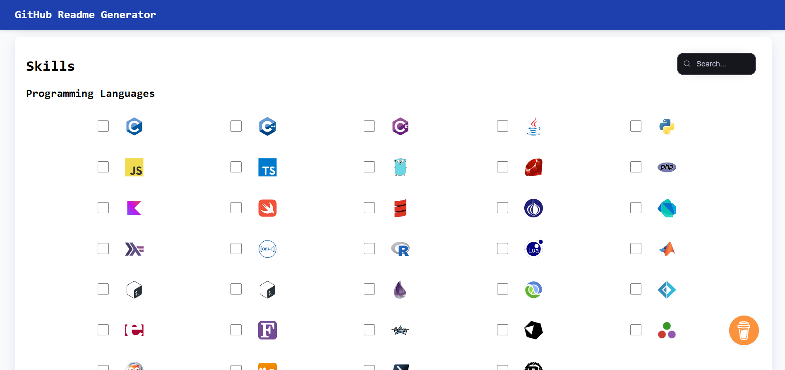
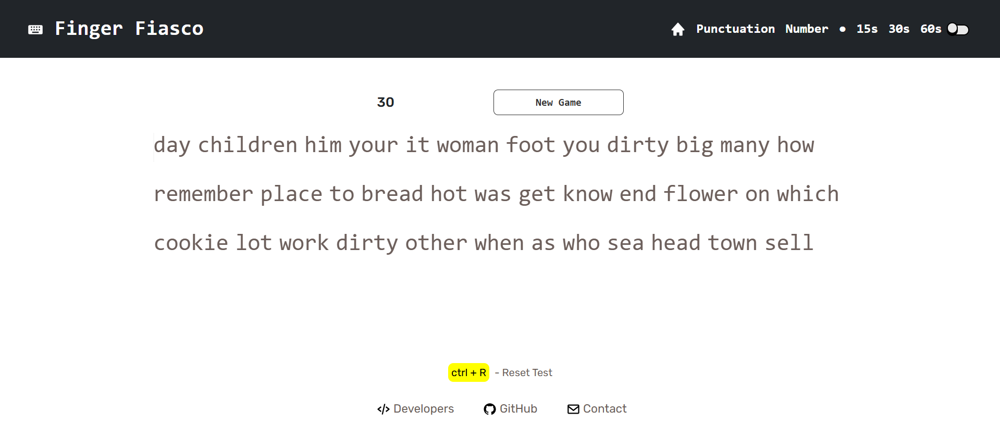
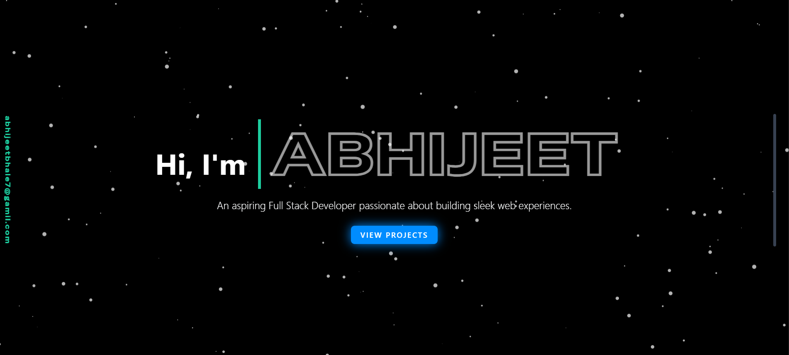
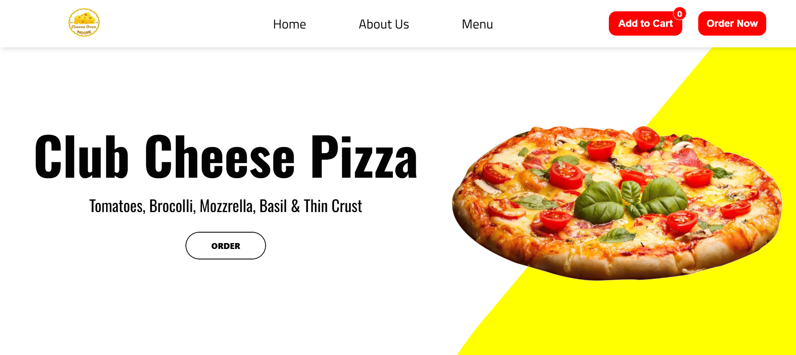

<div align="center">

# 💼 Abhijeet's Portfolio Website

</div>

A modern, responsive personal portfolio website showcasing my work as a full-stack web developer. Built with HTML, CSS, JavaScript, Bootstrap, GSAP, and integrated with a stunning animated particle background.

---

## 🚀 Features

### ✨ **Core Features**
- Responsive design for all screen sizes  
- Interactive hamburger menu for mobile view  
- Hero section with animated name using GSAP  
- Snowfall particle background using [particles.js](http://vincentgarreau.com/particles.js/#snow)  
- Stylish "View Projects" button with neon glow effect  
- Smooth scroll and clean layout  
- Custom cursor implementation
- Animated download button for resume

### 📧 **Contact Form**
- Functional contact form with Formspree integration
- Form validation and user feedback
- Loading states and success/error messages
- Professional styling with hover effects
- Contact information display with icons

### ⚡ **Performance Optimizations**
- Lazy loading for images
- Reduced motion support for accessibility
- Optimized animations with `will-change` and `contain`
- Service Worker for offline functionality
- PWA (Progressive Web App) support
- Critical CSS optimization
- Font loading optimization

### 🐙 **GitHub Integration**
- Live GitHub statistics (repos, stars, followers, commits)
- Recent activity feed with event types
- Most used programming languages display
- Real-time data from GitHub API
- Fallback data for offline viewing

### 🎨 **Enhanced UI/UX**
- Dark theme with custom color scheme
- Smooth animations and transitions
- Interactive elements with hover effects
- Accessibility improvements
- Print-friendly styles

---

## 🛠️ Tech Stack

- **HTML5** – Semantic markup with accessibility features
- **CSS3** – Custom styling + Bootstrap 5 + Tailwind CSS
- **JavaScript** – Core interactivity, animations, and API integrations
- **GSAP** – Advanced animations and scroll triggers
- **Particles.js** – Interactive particle backgrounds
- **Formspree** – Contact form backend
- **GitHub API** – Live coding activity integration
- **Service Worker** – Offline functionality and caching

---

## 📱 PWA Features

- **Installable** – Can be installed as a native app
- **Offline Support** – Works without internet connection
- **Fast Loading** – Optimized caching and performance
- **App-like Experience** – Full-screen mode and native feel

---

## 📸 Live Preview

👉 [Live Demo](https://abhijeetbhale.github.io/Portfolio/)

## 📸 Screenshot


---

## 🚀 Getting Started

1. **Clone the repository**
   ```bash
   git clone https://github.com/abhijeetBhale/Portfolio.git
   cd Portfolio
   ```

2. **Open in browser**
   ```bash
   # Using Python
   python -m http.server 8000
   
   # Using Node.js
   npx serve .
   
   # Or simply open index.html in your browser
   ```

3. **Customize**
   - Update personal information in `index.html`
   - Modify colors in `styles.css`
   - Add your own projects and content
   - Update GitHub username in `script.js`

---

## 📁 Project Structure

```
Portfolio/
├── index.html          # Main HTML file
├── styles.css          # Custom styles and animations
├── script.js           # JavaScript functionality
├── manifest.json       # PWA manifest
├── sw.js              # Service Worker
├── assets/            # Images and media files
└── README.md          # Project documentation
```

---

## 🔧 Configuration

### Contact Form
Update the Formspree endpoint in `script.js`:
```javascript
const response = await fetch('https://formspree.io/f/YOUR_FORM_ID', {
```

### GitHub Integration
Update your GitHub username in `script.js`:
```javascript
const username = 'YOUR_GITHUB_USERNAME';
```

---

## 📈 Performance

- **Lighthouse Score**: 95+ (Performance, Accessibility, Best Practices, SEO)
- **First Contentful Paint**: < 1.5s
- **Largest Contentful Paint**: < 2.5s
- **Cumulative Layout Shift**: < 0.1

---

## 🤝 Contributing

Contributions are welcome! Please feel free to submit a Pull Request.

---

## 📄 License

This project is open source and available under the [MIT License](LICENSE).

---

## 📞 Contact

- **Email**: abhijeetbhale7@gmail.com
- **LinkedIn**: [Abhijeet Bhale](https://www.linkedin.com/in/abhijeetbhale7)
- **GitHub**: [@abhijeetBhale](https://github.com/abhijeetBhale)
- **Instagram**: [@isocyanideisgood](https://www.instagram.com/isocyanideisgood)


PROJECTS SECTION
<section id="projects" class="relative bg-black text-white py-20 px-6 overflow-hidden">

  <!-- PARTICLES BACKGROUND -->
  <div id="particles-projects" class="absolute top-0 left-0 w-full h-full z-0"></div>

  <!-- ACTUAL PROJECT CONTENT -->
  <div class="relative z-10">
    <div class="max-w-6xl mx-auto text-center mb-12">
      <h2 class="text-4xl font-bold mb-4">Projects</h2>
      <p class="text-gray-300 text-lg">Some of the things I've built.</p>
    </div>

    <div class="grid md:grid-cols-2 gap-10 max-w-6xl mx-auto">

      <!-- SINGLE PROJECT CARD -->
      <div class="project-card bg-white text-black shadow-xl rounded-2xl overflow-hidden transform hover:scale-[1.02] transition-all duration-300">
        
        <div class="p-6">
          <h3 class="text-2xl font-semibold mb-2">GitHub Readme Generator</h3>
          <p class="text-gray-700 mb-4">
            Easily create and preview GitHub README files. Generate markdown and download or copy it for your projects.  
            Simple, fast, and no sign-up needed.
          </p>

          <!-- Tech Stack Badges -->
            <div class="flex flex-wrap gap-3 mb-4">
            <span class="flex items-center gap-1 bg-gray-100 px-2 py-1 text-xs rounded cursor-pointer">
              
              React
            </span>
            <span class="flex items-center gap-1 bg-gray-100 px-2 py-1 text-xs rounded cursor-pointer">
              
              Tailwind CSS
            </span>
            <span class="flex items-center gap-1 bg-gray-100 px-2 py-1 text-xs rounded cursor-pointer">
              
              Markdown
            </span>
            <span class="flex items-center gap-1 bg-gray-100 px-2 py-1 text-xs rounded cursor-pointer">
              
              Netlify
            </span>
            <span class="flex items-center gap-1 bg-gray-100 px-2 py-1 text-xs rounded cursor-pointer">
              
              Vite
            </span>
            </div>

          <!-- Project Links -->
          <div class="flex gap-4">
            <a href="https://readme-generator-github-abhijeetbhale.netlify.app/" target="_blank"
              class="bg-[#1DCD9F] text-white px-4 py-2 rounded hover:bg-[#17b890] transition-all text-sm">
              Live Demo 
            </a>
            <a href="https://github.com/abhijeetBhale/Readme-Generator" target="_blank"
              class="bg-gray-800 text-white px-4 py-2 rounded hover:bg-gray-700 transition-all text-sm">
              GitHub 
            </a>
          </div>
        </div>
      </div>
      <!-- /SINGLE PROJECT CARD -->

      <!-- SINGLE PROJECT CARD -->
      <div class="project-card bg-white text-black shadow-xl rounded-2xl overflow-hidden transform hover:scale-[1.02] transition-all duration-300">
        
        <div class="p-6">
          <h3 class="text-2xl font-semibold mb-2">Boost AI</h3>
          <p class="text-gray-700 mb-4">
            An AI productivity tool using Google Gemini for content generation and task automation. Includes real-time chat and document analysis. Fast, simple, and secure.
          </p>

          <!-- Tech Stack Badges -->
          <div class="flex flex-wrap gap-3 mb-4">
            <span class="flex items-center gap-1 bg-gray-100 px-2 py-1 text-xs rounded cursor-pointer">
              
              React
            </span>
            <span class="flex items-center gap-1 bg-gray-100 px-2 py-1 text-xs rounded cursor-pointer">
              
              MongoDB
            </span>
            <span class="flex items-center gap-1 bg-gray-100 px-2 py-1 text-xs rounded cursor-pointer">
              
              Node.js
            </span>
            <span class="flex items-center gap-1 bg-gray-100 px-2 py-1 text-xs rounded cursor-pointer">
              
              Gemini
            </span>
            <span class="flex items-center gap-1 bg-gray-100 px-2 py-1 text-xs rounded cursor-pointer">
              
              Express
            </span>
          </div>

          <!-- Project Links -->
          <div class="flex gap-4">
            <a href="https://boost-ai-chat.vercel.app/" target="_blank"
              class="bg-[#1DCD9F] text-white px-4 py-2 rounded hover:bg-[#17b890] transition-all text-sm">
              Live Demo 
            </a>
            <a href="https://github.com/abhijeetBhale/chatgpt-clone" target="_blank"
              class="bg-gray-800 text-white px-4 py-2 rounded hover:bg-gray-700 transition-all text-sm">
              GitHub 
            </a>
          </div>
        </div>
      </div>
      <!-- /SINGLE PROJECT CARD -->

      <!-- SINGLE PROJECT CARD -->
      <div class="project-card bg-white text-black shadow-xl rounded-2xl overflow-hidden transform hover:scale-[1.02] transition-all duration-300">
        
        <div class="p-6">
          <h3 class="text-2xl font-semibold mb-2">Pinterest Clone</h3>
          <p class="text-gray-700 mb-4">
            A visually rich Pinterest Clone built with React, React Router, and Tailwind CSS.
          </p>

          <!-- Tech Stack Badges -->
          <div class="flex flex-wrap gap-3 mb-4">
            <span class="flex items-center gap-1 bg-gray-100 px-2 py-1 text-xs rounded cursor-pointer">
              
              React
            </span>
            <span class="flex items-center gap-1 bg-gray-100 px-2 py-1 text-xs rounded cursor-pointer">
              
              Tailwindcss
            </span>
            <span class="flex items-center gap-1 bg-gray-100 px-2 py-1 text-xs rounded cursor-pointer">
              
              ReactRouter
            </span>
            <span class="flex items-center gap-1 bg-gray-100 px-2 py-1 text-xs rounded cursor-pointer">
              
              MongoDB
            </span>
            <span class="flex items-center gap-1 bg-gray-100 px-2 py-1 text-xs rounded cursor-pointer">
                
                Node.js
            </span>
          </div>

          <!-- Project Links -->
          <div class="flex gap-4">
            <a href="https://github.com/abhijeetBhale/Pinterest-Clone" target="_blank"
              class="bg-[#1DCD9F] text-white px-4 py-2 rounded hover:bg-[#17b890] transition-all text-sm">
              Live Demo 
            </a>
            <a href="https://github.com/abhijeetBhale/Pinterest-Clone" target="_blank"
              class="bg-gray-800 text-white px-4 py-2 rounded hover:bg-gray-700 transition-all text-sm">
              GitHub 
            </a>
          </div>
        </div>
      </div>
      <!-- /SINGLE PROJECT CARD -->

       <!-- SINGLE PROJECT CARD -->
      <div class="project-card bg-white text-black shadow-xl rounded-2xl overflow-hidden transform hover:scale-[1.02] transition-all duration-300">
        
        <div class="p-6">
          <h3 class="text-2xl font-semibold mb-2">Finger Fiasco</h3>
          <p class="text-gray-700 mb-4">
            A fast-paced typing game to test and improve your typing speed. Built using HTML, CSS, JavaScript with custom game logic and animated UI.
          </p>

          <!-- Tech Stack Badges -->
          <div class="flex flex-wrap gap-3 mb-4">
            <span class="flex items-center gap-1 bg-gray-100 px-2 py-1 text-xs rounded cursor-pointer">
              
              HTML
            </span>
            <span class="flex items-center gap-1 bg-gray-100 px-2 py-1 text-xs rounded cursor-pointer">
              
              CSS
            </span>
            <span class="flex items-center gap-1 bg-gray-100 px-2 py-1 text-xs rounded cursor-pointer">
              
              Bootstrap
            </span>
            <span class="flex items-center gap-1 bg-gray-100 px-2 py-1 text-xs rounded cursor-pointer">
              
              JavaScript
            </span>
          </div>

          <!-- Project Links -->
          <div class="flex gap-4">
            <a href="https://abhijeetbhale.github.io/FingerFiasco/home.html" target="_blank"
              class="bg-[#1DCD9F] text-white px-4 py-2 rounded hover:bg-[#17b890] transition-all text-sm">
              Live Demo
            </a>
            <a href="https://github.com/abhijeetbhale/FingerFiasco" target="_blank"
              class="bg-gray-800 text-white px-4 py-2 rounded hover:bg-gray-700 transition-all text-sm">
              GitHub
            </a>
          </div>
        </div>
      </div>
      <!-- /SINGLE PROJECT CARD -->

      <!-- SINGLE PROJECT CARD -->
      <div class="project-card bg-white text-black shadow-xl rounded-2xl overflow-hidden transform hover:scale-[1.02] transition-all duration-300">
        
        <div class="p-6">
          <h3 class="text-2xl font-semibold mb-2">Portfolio Website</h3>
          <p class="text-gray-700 mb-4">
            My portfolio website featuring my projects, skills, and journey. Built with HTML, CSS, and JavaScript for a modern, interactive experience.
          </p>

          <!-- Tech Stack Badges -->
          <div class="flex flex-wrap gap-3 mb-4">
            <span class="flex items-center gap-1 bg-gray-100 px-2 py-1 text-xs rounded cursor-pointer">
                
              HTML
            </span>
            <span class="flex items-center gap-1 bg-gray-100 px-2 py-1 text-xs rounded cursor-pointer">
              
              Tailwindcss
            </span>
            <span class="flex items-center gap-1 bg-gray-100 px-2 py-1 text-xs rounded cursor-pointer">
                
              JavaScript
            </span>
            <span class="flex items-center gap-1 bg-gray-100 px-2 py-1 text-xs rounded cursor-pointer">
                
              CSS
            </span>
            <span class="flex items-center gap-1 bg-gray-100 px-2 py-1 text-xs rounded cursor-pointer">
              
              Framer Motion
            </span>
          </div>

          <!-- Project Links -->
          <div class="flex gap-4">
            <a href="https://abhijeetbhale.github.io/Portfolio/" target="_blank"
              class="bg-[#1DCD9F] text-white px-4 py-2 rounded hover:bg-[#17b890] transition-all text-sm">
              Live Demo 
            </a>
            <a href="https://github.com/abhijeetBhale/Portfolio" target="_blank"
              class="bg-gray-800 text-white px-4 py-2 rounded hover:bg-gray-700 transition-all text-sm">
              GitHub 
            </a>
          </div>
        </div>
      </div>
      <!-- /SINGLE PROJECT CARD -->

      <!-- SINGLE PROJECT CARD -->
      <div class="project-card bg-white text-black shadow-xl rounded-2xl overflow-hidden transform hover:scale-[1.02] transition-all duration-300">
        
        <div class="p-6">
          <h3 class="text-2xl font-semibold mb-2">Cheese Oven</h3>
          <p class="text-gray-700 mb-4">
            A vibrant and appetizing landing page for a pizza store, an interactive menu, online ordering, and special offers to entice customers.
          </p>

          <!-- Tech Stack Badges -->
            <div class="flex flex-wrap gap-3 mb-4">
            <span class="flex items-center gap-1 bg-gray-100 px-2 py-1 text-xs rounded cursor-pointer">
              
              HTML
            </span>
            <span class="flex items-center gap-1 bg-gray-100 px-2 py-1 text-xs rounded cursor-pointer">
              
              CSS
            </span>
            <span class="flex items-center gap-1 bg-gray-100 px-2 py-1 text-xs rounded cursor-pointer">
              
              Bootstrap
            </span>
            <span class="flex items-center gap-1 bg-gray-100 px-2 py-1 text-xs rounded cursor-pointer">
              
              JavaScript
            </span>
            </div>

          <!-- Project Links -->
          <div class="flex gap-4">
            <a href="https://abhijeetbhale.github.io/Landing-Page-Project-Cheese-Oven/" target="_blank"
              class="bg-[#1DCD9F] text-white px-4 py-2 rounded hover:bg-[#17b890] transition-all text-sm">
              Live Demo 
            </a>
            <a href="https://github.com/abhijeetbhale/Landing-Page-Project-Cheese-Oven" target="_blank"
              class="bg-gray-800 text-white px-4 py-2 rounded hover:bg-gray-700 transition-all text-sm">
              GitHub 
            </a>
          </div>
        </div>
      </div>
      <!-- /SINGLE PROJECT CARD -->
    </div>
  </div>
</section>


<!-- JOURNEY SECTION -->
<section id="journey" class="bg-black text-white py-20 px-6">
  <div class="max-w-6xl mx-auto">
    <h2 class="text-4xl font-bold mb-16 text-center text-[#1DCD9F]">My Journey</h2>
    
    <div class="relative">
      <!-- Vertical Line -->
      <div class="hidden md:block absolute left-1/2 transform -translate-x-1/2 h-full w-1 bg-[#1DCD9F]"></div>

      <!-- Timeline Card 1 - Right -->
      <div class="relative mb-16 md:mb-24 md:flex justify-end">
        <div class="hidden md:block absolute w-4 h-4 bg-[#1DCD9F] rounded-full left-1/2 transform -translate-x-1/2 top-4 z-10"></div>
        <div class="md:w-1/2"></div>
        <div class="md:w-1/2 md:pl-10">
          <div class="bg-[#111] p-6 rounded-2xl border border-[#1DCD9F] shadow-lg journey-card">
            <h3 class="text-xl font-semibold text-[#1DCD9F]">E-commerce Admin at Tomo Goods</h3>
            <span class="text-sm text-gray-400">May 2023 - Aug 2023</span>
            <p class="mt-2 text-gray-300">As an E-commerce Admin at Tomo Goods, I was responsible for managing daily online store operations and ensuring a smooth customer experience.</p>
          </div>
        </div>
      </div>

      <!-- Timeline Card 2 - Left -->
      <div class="relative mb-16 md:mb-24 md:flex justify-start">
        <div class="hidden md:block absolute w-4 h-4 bg-[#1DCD9F] rounded-full left-1/2 transform -translate-x-1/2 top-4 z-10"></div>
        <div class="md:w-1/2 md:pr-10">
          <div class="bg-[#111] p-6 rounded-2xl border border-[#1DCD9F] shadow-lg journey-card">
            <h3 class="text-xl font-semibold text-[#1DCD9F]"> Undergraduate Student – Information Systems</h3>
            <span class="text-sm text-gray-400">Bina Sarana Informatika University (September 2024 - Present)</span>
            <p class="mt-2 text-gray-300">I am committed to developing both academic knowledge and real-world skills by balancing my studies with part-time professional experience.</p>
          </div>
        </div>
        <div class="md:w-1/2"></div> 
      </div>

      <!-- Timeline Card 3 - Right -->
      <div class="relative mb-16 md:mb-24 md:flex justify-end">
        <div class="hidden md:block absolute w-4 h-4 bg-[#1DCD9F] rounded-full left-1/2 transform -translate-x-1/2 top-4 z-10"></div>
        <div class="md:w-1/2"></div>
        <div class="md:w-1/2 md:pl-10">
          <div class="bg-[#111] p-6 rounded-2xl border border-[#1DCD9F] shadow-lg journey-card">
            <h3 class="text-xl font-semibold text-[#1DCD9F]">Baker at PT. CJ Foodville</h3>
            <span class="text-sm text-gray-400">December 2024 - Present</span>
            <p class="mt-2 text-gray-300">Currently working as a Baker, where I focus on producing high-quality baked goods in a fast-paced environment.</p>
          </div>
        </div>
      </div>
      
    </div>
  </div>
</section>